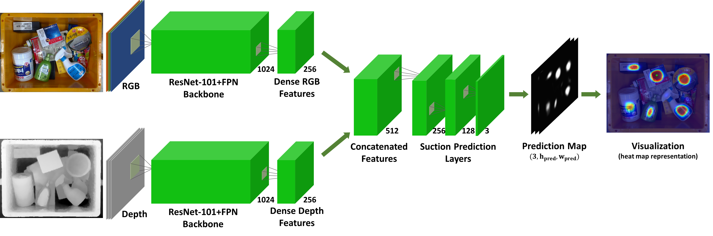
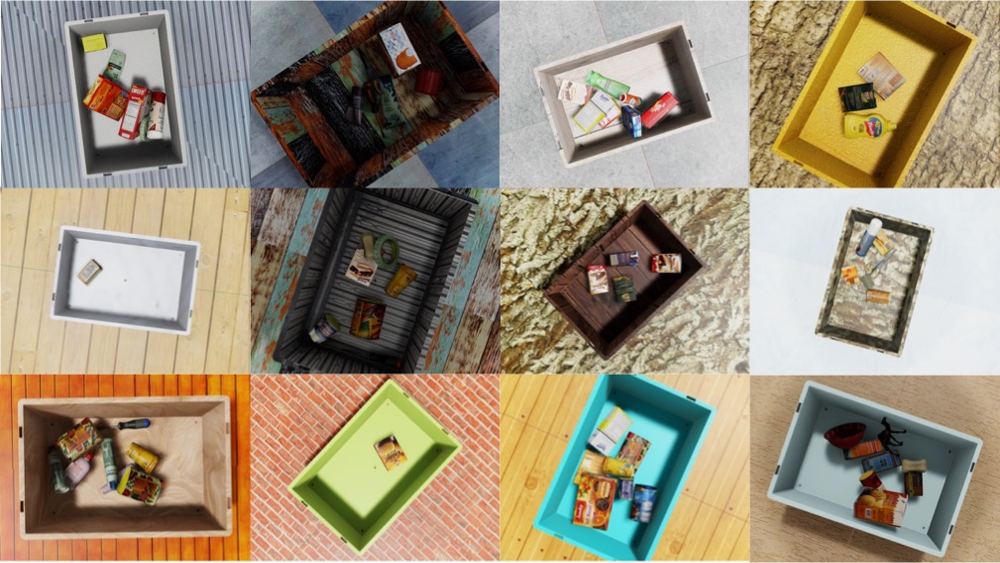

# CoAS-Net #

### CoAS-Net: Context-Aware Suction Network with a Large-Scale Domain Randomized Synthetic Dataset

CoAS-Net is a CNN-based suction grasp detection network trained with our large-scale synthetic dataset (CoAS-Dataset).



<br />

# How to Use?
The code has been tested on ubuntu `18.04`, `20.04` with `CUDA 11.x` and `pytorch 1.10.2`. We tested our network with Intel Realsense **L515** and Microsoft **AzureKinect**.

### Prerequisites
**1. Clone the repository and install dependencies.**
```
git clone https://github.com/SonYeongGwang/CoAS-Net.git
cd CoAS-Net
pip install -r requirements.txt
```

**2. Download model checkpoint.**
- [Model Checkpoint](https://o365skku-my.sharepoint.com/:f:/g/personal/syoungk20_o365_skku_edu/Es5_B8mhHlJAk2LGB-9Zx3cBcUvxAShcSrDP2m0MZYJWkA?e=GI5d8e)
```
cd CoAS-Net
mkdir checkpoint
cp /path/to/downloaded/checkpoint CoAS-Net/checkpoint
```

**3. Run the model!**

```
cd CoAS-Net
```

- To replicate with example images
```
# real images
python predict.py --example_modality real

# synthetic images
python predict.py --example_modality sim

```
- To replicate in your environment
```
# with L515
python predict.py --mode streaming --camera_model L515

# with Kinect
python predict.py --mode streaming --camera_model Kinect
```

### *(Optional)*

To work with Kinect camera, we use Open3D methods based on the Azure Kinect SDK (K4A). Pleaze refer [Open3D Kinect](http://www.open3d.org/docs/latest/tutorial/Basic/azure_kinect.html) for more infromation.
<br />

# Dataset


Our dataset contains 50k RGB-D images from 6,250 different scenes and it consists of **RGB**, **Depth**, and **Label** images of various scenes and **Pose Information** of the objects and the camera.


```
CoAS-Dataset
├── Train-set
├── Validation-set
├── Test-set
│     ├── rgb
│     │     └── rgb in .png format
│     ├── depth
│     │     └── depth in .npy format
│     ├── label
│     │     └── label in .png format
│     ├── object_world_poses_1.npz -> pose information(objects, camera)
│     │     '''
│     └── object_world_poses_n.npz
│
└── camera_intrinsic.txt
```

- Object pose and camera pose are defined with respect to the world frame of Isaac sim.

You can download our dataset from [RGB-D dataset](https://o365skku-my.sharepoint.com/:f:/g/personal/syoungk20_o365_skku_edu/El6x_qcSfwNGvvIlWl1GuJ8BP3FEfseothtk2DDMbwUjYQ?e=D6rerx) link.
We recommend you to have free space > 100GB in you disk(s) for using our dataset.

Also you can download 3D mesh models used in our dataset from [mesh models](https://o365skku-my.sharepoint.com/:f:/g/personal/syoungk20_o365_skku_edu/EjseVNpzhy9JkZelChdkpGIBnBcVzMLc5mxvqLVcY2a7tA?e=rNzd32) which is consists of models from [1]-[3].

# References
```
[1] B. Calli, A. Singh, A. Walsman, S. Srinivasa, P. Abbeel, and A. M.Dollar, “The YCB object and Model set: Towards common benchmarks for manipulation research,” in Proc. IEEE Int. Conf. Adv. Robot., 2015, pp. 510–517.
[2] A. Kasper, Z. Xue, and R. Dillmann, “The KIT object models database: An object model database for object recognition, localization and manipulation in service robotics,” Int. J. Robot. Res., vol. 31, no. 8, pp. 927–934, May. 2022
[3] H. Cao, H. S. Fang, W. Liu, and C. Lu, “Suctionnet-1billion: A large-scale benchmark for suction grasping,” IEEE Robot. Automat. Lett., vol. 6, no. 4, pp. 8718–8725, Oct. 2021.
```